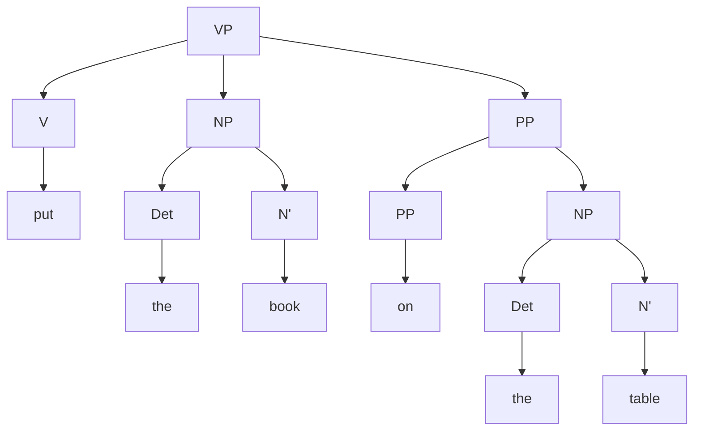
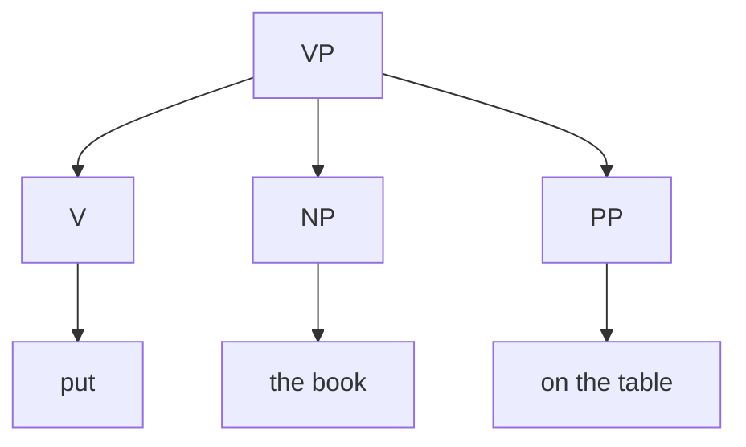

>[!example] "Devour" subcategorizes for an NP.
> 1. "The child devoured (NP)[the sandwich]" is valid, while
> 2. "The child devoured." (without an NP) is invalid.

The term ==**subcategorization**== is used to describe the requirement that a word must be followed by a certain complement; they're CFL transitions. Full tables of transitions are below. Particular verbs can admit multiple complement options. When a verb's complement options include NP, it is ==**transitive**==, and the NP is called the ==**direct object**==; here some some examples.

| Complement option       | Sample heads       | Example                                |
| ----------------------- | ------------------ | -------------------------------------- |
| $\text{NP}$             | devour, cut, prove | The professor proved [NP the theorem]. |
| $\text{NP}$ $\text{NP}$ | tell, hand, give   | We handed [NP the man] [NP a map].     |

 Otherwise, it is ==**intransitive**==.

Inspecting the tables below, it is notable that our trees do not have to be binary anymore; for example,

| Complement option                    | Sample heads      | Example                                     |
| ------------------------------------ | ----------------- | ------------------------------------------- |
| $\text{NP}$ $\text{PP}_{\text{loc}}$ | put, place, stand | Chris put [NP the muffler] [PP on the car]. |

Sometimes, we don't care about the details of a subtree, and we use the following notation:

# English Tables

Some examples of verb complements:

| Complement option                                              | Sample heads        | Example                                                    |
| -------------------------------------------------------------- | ------------------- | ---------------------------------------------------------- |
| $\emptyset$                                                    | vanish, arrive, die | The rabbit vanished.                                       |
| $\text{NP}$                                                    | devour, cut, prove  | The professor proved [NP the theorem].                     |
| $\text{AP}$                                                    | be, become          | The man became [AP very angry].                            |
| $\text{PP}_{\text{to}}$                                        | dash, talk, refer   | The dog dashed [PP to the door].                           |
| $\text{NP}$ $\text{NP}$                                        | tell, hand, give    | We handed [NP the man] [NP a map].                         |
| $\text{NP}$ $\text{PP}_{\text{to}}$                            | hand, give, send    | She gave [NP a diploma] [PP to the student].               |
| $\text{NP}$ $\text{PP}_{\text{for}}$                           | buy, cook, reserve  | We bought [NP a hat] [PP for Andy].                        |
| $\text{NP}$ $\text{PP}_{\text{loc}}$                           | put, place, stand   | Chris put [NP the muffler] [PP on the car].                |
| $\text{PP}_{\text{to}}$ $\text{PP}_{\text{about}}$             | talk, speak         | I talked [PP to a doctor] [PP about Sue].                  |
| $\text{NP}$ $\text{PP}_{\text{for}}$ $\text{PP}_{\text{with}}$ | open, fix           | We opened [NP the door] [PP for Andy] [PP with a crowbar]. |

---

Some examples of noun complements:

| Complement option                                    | Sample heads                        | Example                                             |
| ---------------------------------------------------- | ----------------------------------- | --------------------------------------------------- |
| $\emptyset$                                          | car, boy, electricity               | the car                                             |
| $\text{PP}_{\text{of}}$                              | memory, failure, death              | the memory [PP of a friend]                         |
| $\text{PP}_{\text{of}}$ $\text{PP}_{\text{to}}$      | presentation, description, donation | the presentation [PP of a medal] [PP to the winner] |
| $\text{PP}_{\text{with}}$ $\text{PP}_{\text{about}}$ | argument, discussion, conversation  | an argument [PP with Stella] [PP about politics]    |

---

Some examples of adjective complements

| Complement option          | Sample heads         | Example                     |
| -------------------------- | -------------------- | --------------------------- |
| $\emptyset$                | tall, green, smart   | very tall                   |
| $\text{PP}_{\text{about}}$ | curious, glad, angry | curious [PP about China]    |
| $\text{PP}_{\text{to}}$    | apparent, obvious    | obvious [PP to the student] |
| $\text{PP}_{\text{of}}$    | fond, full, sick     | fond [PP of chocolate]      |

---

Some examples of preposition complements

| Complement option | Sample heads     | Example                   |
| ----------------- | ---------------- | ------------------------- |
| $\emptyset$       | near, away, down | (he got) down             |
| $\text{NP}$       | in, on, by, near | in [NP the house]         |
| $\text{PP}$       | down, up, out    | down [PP into the cellar] |
