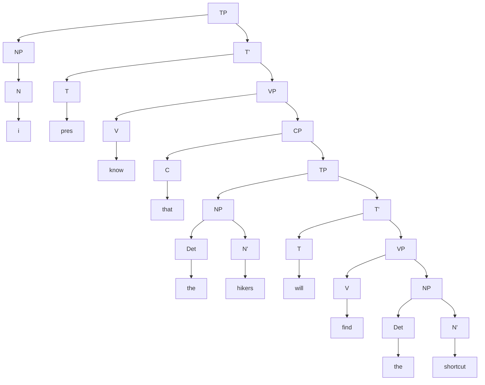

A ==**complementizer**== allows a sentential clause to be used as a complement.

```mermaid
graph TD;
%% "I know that the hikers will find the shortcut"
tp_i_know_that_the_hikers_will_find_the_shortcut[TP] --> np_i[NP];
np_i --> n_i[N];
n_i --> i;
tp_i_know_that_the_hikers_will_find_the_shortcut --> t_know_that_the_hikers_will_find_the_shortcut[T'];
t_know_that_the_hikers_will_find_the_shortcut --> t_tense[T];
t_tense --> present_tense[pres];
t_know_that_the_hikers_will_find_the_shortcut --> vp_know_that_the_hikers_will_find_the_shortcut[VP];
vp_know_that_the_hikers_will_find_the_shortcut --> v_know[V];
v_know --> know;
vp_know_that_the_hikers_will_find_the_shortcut --> cp_that_the_hikers_will_find_the_shortcut[CP];
cp_that_the_hikers_will_find_the_shortcut --> c_that[C];
c_that --> that;
cp_that_the_hikers_will_find_the_shortcut --> tp_the_hikers_will_find_the_shortcut[TP];
tp_the_hikers_will_find_the_shortcut --> np_the_hikers[NP];
np_the_hikers --> det_the_hikers[Det];
det_the_hikers --> the;
np_the_hikers --> n_hikers[N'];
n_hikers --> hikers;
tp_the_hikers_will_find_the_shortcut --> tense_will_find_the_shortcut[T'];
tense_will_find_the_shortcut --> future_tense[T];
future_tense --> will;
tense_will_find_the_shortcut --> vp_find_the_shortcut[VP];
vp_find_the_shortcut --> v_find[V];
v_find --> find;
vp_find_the_shortcut --> np_the_shortcut[NP];
np_the_shortcut --> det_the_shortcut[Det];
det_the_shortcut --> the_2[the];
np_the_shortcut --> n_shortcut[N'];
n_shortcut --> shortcut;
```
