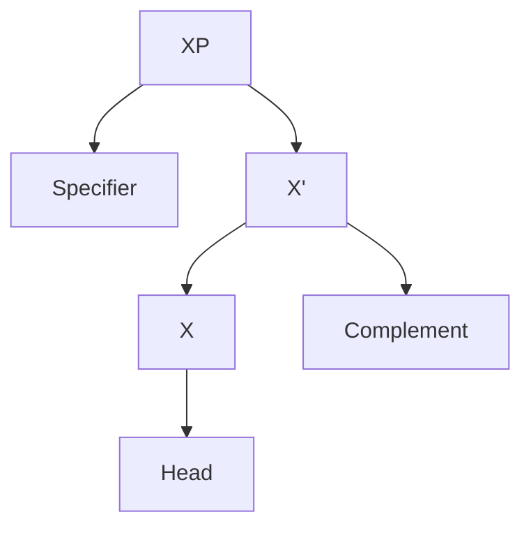
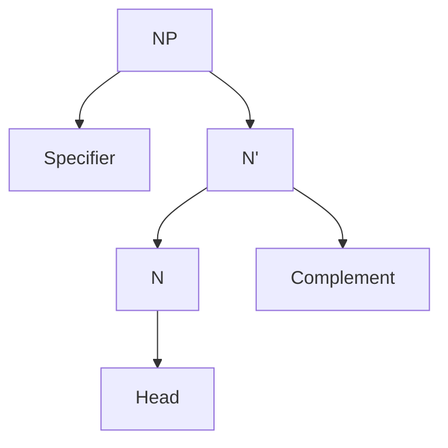
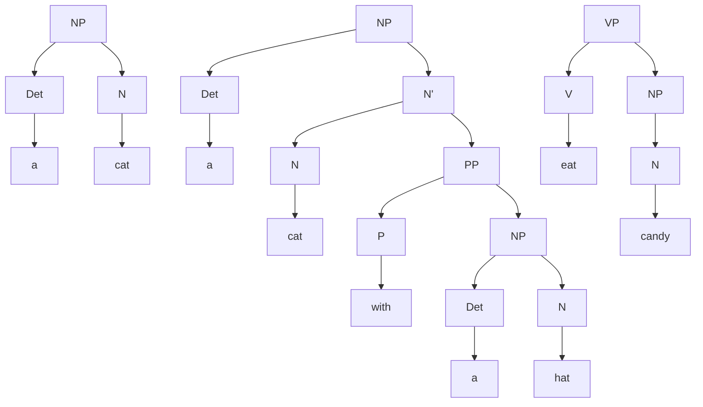
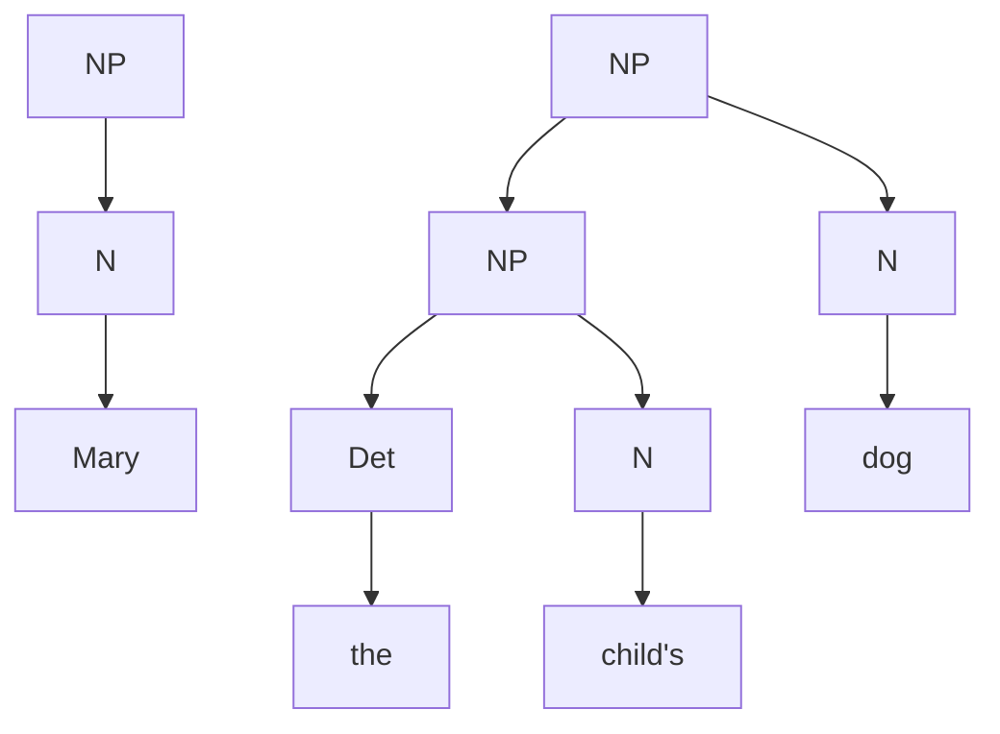

>[!idea]
> WOAH I did not realize that Obsidian had native support for Mermaid diagrams! ...I might have to do all my Syntax homework in Obsidian from now on.

Here is the ==**X' Schema**==:

The ==**Head**== is the (required) nucleus of the phrase, in $\{N, V, A, P\}$. If the type of the head is a noun (N), then the diagram might look like this:

Here, "NP" means "Noun Phrase."

The ==**Specifier**== always occurs at the edge of a phrase, and is (optional for now). In English, it is always at the beginning of the phrase.
- For Nouns, the specifier is either a determiner (e.g. "the", "a", "this", "that", "some", "any") or a possessive (see below).
- For Verbs, the specifier is almost always a (preverbal) adverb (e.g. "quickly", "happily", "very", "too", "again").
- For Adjectives or Prepositions, the specifier is a degree word (e.g. "very", "too", "extremely", "quite").

The ==**Complement**== is an (optional for now) phrase providing information about entities or locations implied by the meaning of the head.

Finally, if the Specifer or Complement are omitted, then we can compress the tree structure.

Hence, here are some examples of valid trees:

Some more cases:
- We treat pronouns as N's.
- We treat possessives as NP's which can fill the roll of a specifier.

