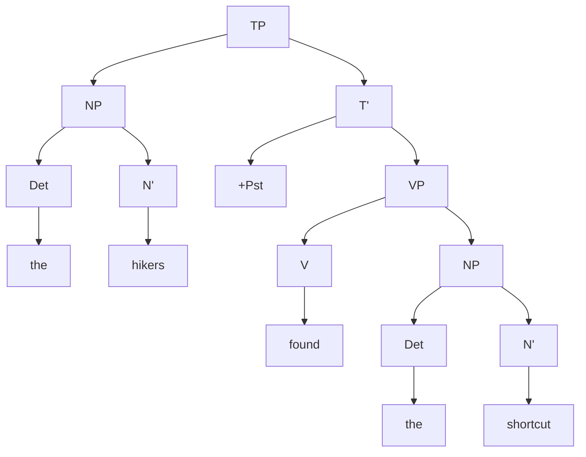
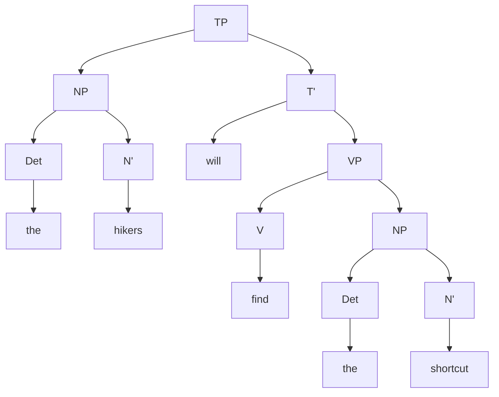

Sentences introduce a new variable to our CFL: tense categories (T, T') and "Tense Phrases" (TP) which are entire sentences. TP's are also called ==**sentential phrases**== or ==**clauses**==.

A ==**modal auxilliary**== (historically, "auxilliary verbs") such as "can", "could", "may", "might", "must", "shall", "should", "will", "would" have T inherent tense, and hence are T's.

