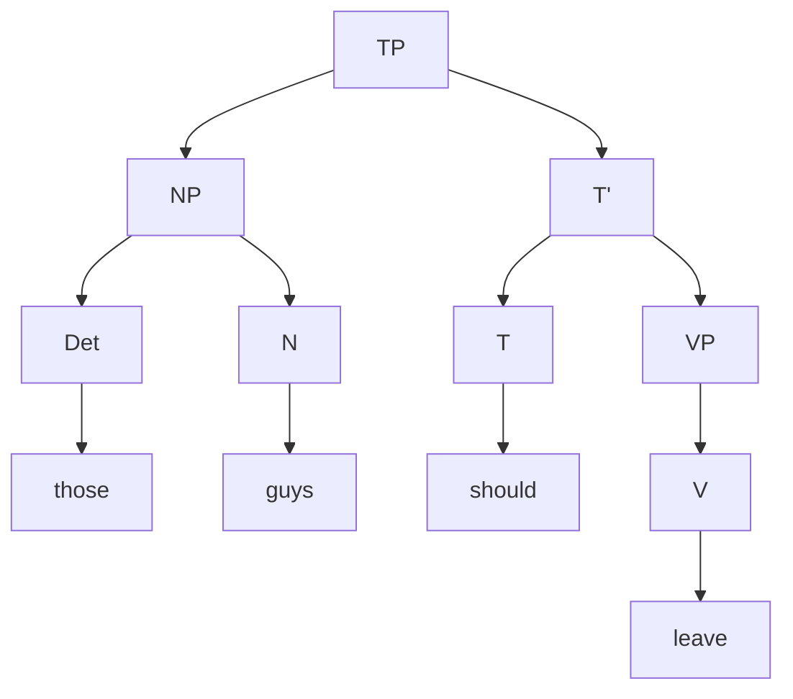
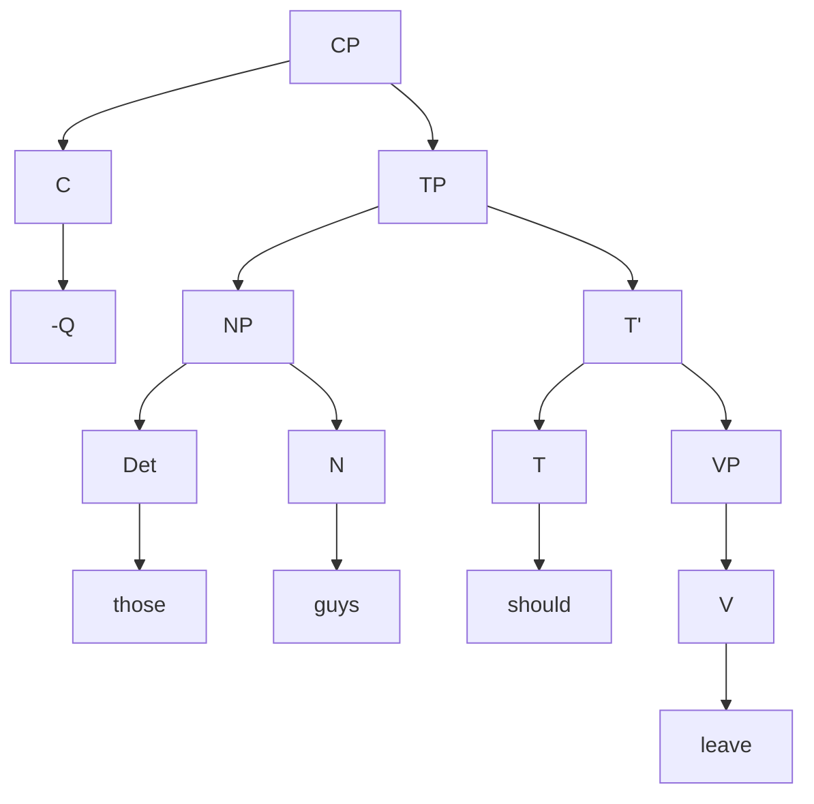
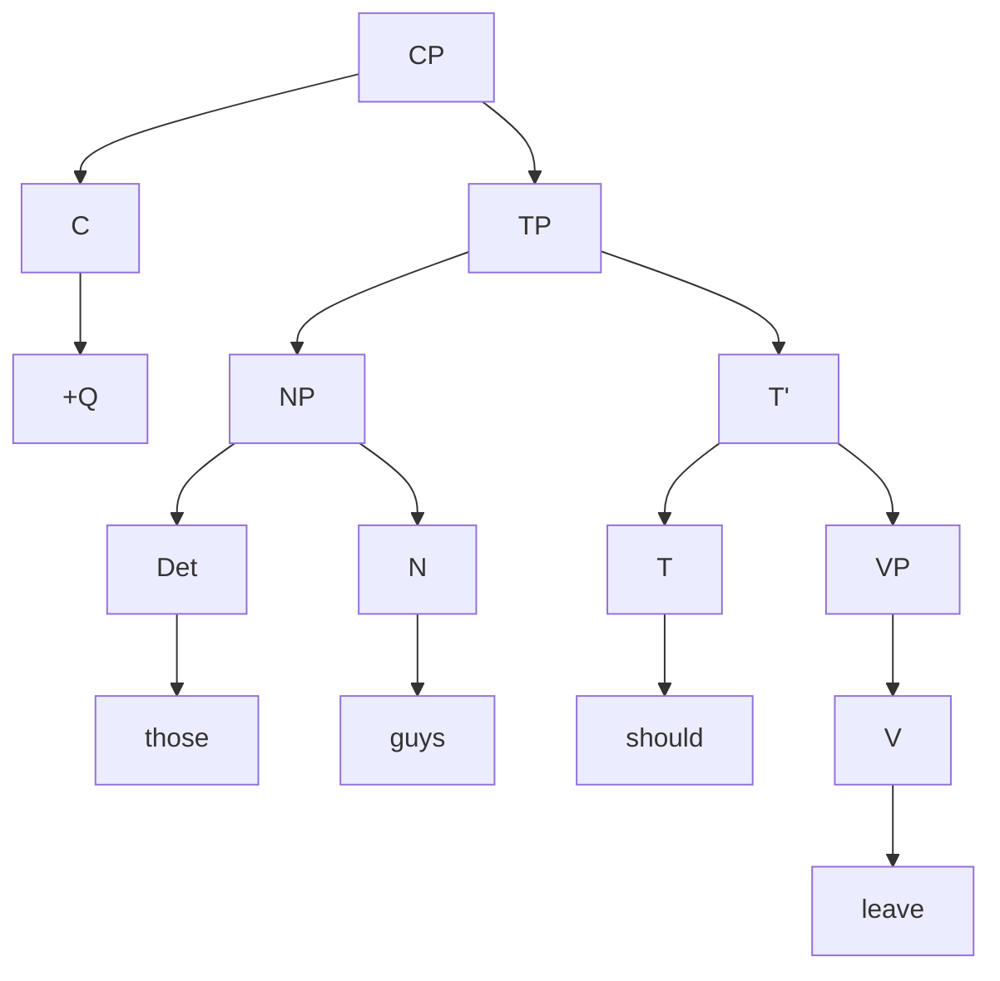
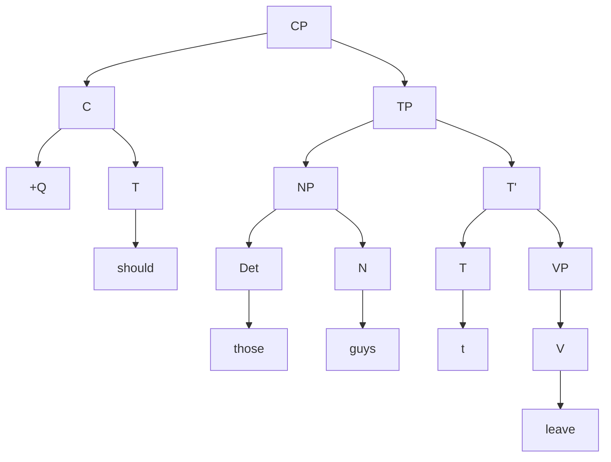
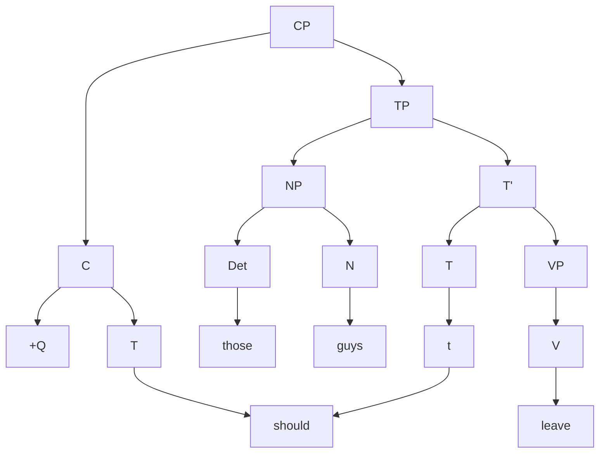

Consider the following two sentences:

1. Those guys should leave.
2. Should those guys leave?

The first sentence is a statement, while the second sentence is a question.

The tree diagram for the first sentence is:

We make two claims about this tree: there is a hidden external CP shell wrapping the entire tree, whose C position encodes that the sentence is a statement, possessing a -Q feature (non-question).

To transform this into a question, we turn the -Q feature into a +Q feature.

The problem is, +Q and -Q currently are indistinguishable. To solve this, we introduce the ==**move operation**==, which claims that the internal T element of the TP should move to the external C position.

In the location where the "should" was, we insert a "t" element, which is a "trace" of the original T element. We can indicate the specific movement with an additional arrow:

