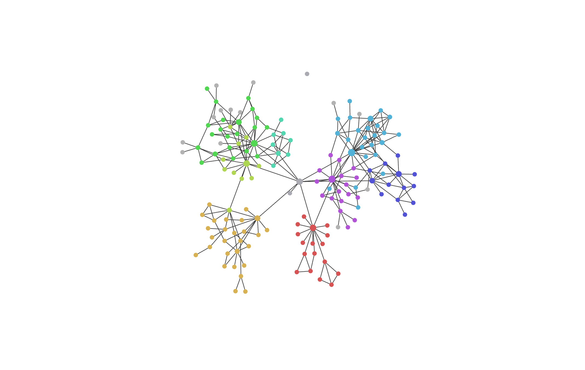

These are Rowechen Zhong's personal notes on mathematics, following Feynman's advice on mastery by teaching. To begin, check out some [[homepage|homepages]].

They are meant to be viewed in Obsidian (https://publish.obsidian.md/vision), but they can also be viewed just as plain markdown. Links will not work, because they are Obsidian-specific.

> [!idea]
> This ==**graph view**== shows the state of Vision. Different colors correspond to different subjects.

Please remember that these are just notes! They contain lots of errors. Email me at rowechen@mit.edu if you want to tell me about any errors, or if you have any questions or comments.