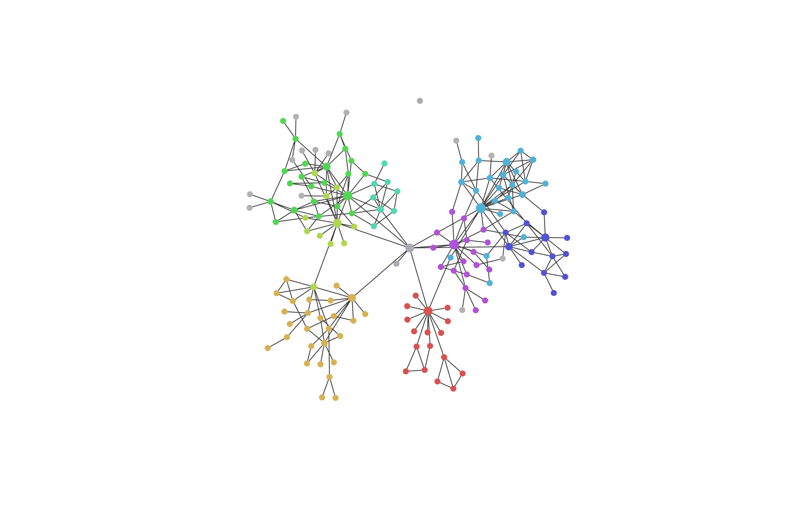

$\require{physics}\newcommand{\cbrt}[1]{\sqrt[3]{#1}}\newcommand{\sgn}{\text{sgn}}\newcommand{\ii}[1]{\textit{#1}}\newcommand{\eps}{\varepsilon}\newcommand{\EE}{\mathbb E}\newcommand{\PP}{\mathbb P}\newcommand{\Var}{\mathrm{Var}}\newcommand{\Cov}{\mathrm{Cov}}\newcommand{\pperp}{\perp\kern-6pt\perp}\newcommand{\LL}{\mathcal{L}}\newcommand{\pa}{\partial}\newcommand{\AAA}{\mathscr{A}}\newcommand{\BBB}{\mathscr{B}}\newcommand{\FFF}{\mathscr{F}}\newcommand{\GGG}{\mathscr{G}}\newcommand{\HHH}{\mathscr{H}}\DeclareMathOperator{\ess}{ess}\newcommand{\CC}{\mathbb C}\newcommand{\FF}{\mathbb F}\newcommand{\NN}{\mathbb N}\newcommand{\QQ}{\mathbb Q}\newcommand{\RR}{\mathbb R}\newcommand{\ZZ}{\mathbb Z}\newcommand{\KK}{\mathbb K}\newcommand{\SSS}{\mathbb S}\newcommand{\II}{\mathbb I}\newcommand{\conj}[1]{\overline{#1}}\DeclareMathOperator{\cis}{cis}\newcommand{\abs}[1]{\left\lvert #1 \right\rvert}\newcommand{\norm}[1]{\left\lVert #1 \right\rVert}\newcommand{\floor}[1]{\left\lfloor #1 \right\rfloor}\newcommand{\ceil}[1]{\left\lceil #1 \right\rceil}\DeclareMathOperator*{\range}{range}\DeclareMathOperator*{\nul}{null}\DeclareMathOperator*{\Tr}{Tr}\DeclareMathOperator*{\tr}{Tr}\newcommand{\id}{1\!\!1}\newcommand{\Id}{1\!\!1}\newcommand{\der}{\ \mathrm {d}}\newcommand{\Zc}[1]{\ZZ / #1 \ZZ}\newcommand{\Zm}[1]{\left(\ZZ / #1 \ZZ\right)^\times}\DeclareMathOperator{\Hom}{Hom}\DeclareMathOperator{\End}{End}\newcommand{\GL}{\mathbb{GL}}\newcommand{\SL}{\mathbb{SL}}\newcommand{\SO}{\mathbb{SO}}\newcommand{\OO}{\mathbb{O}}\newcommand{\SU}{\mathbb{SU}}\newcommand{\U}{\mathbb{U}}\newcommand{\gl}{\mathfrak{gl}}\newcommand{\sl}{\mathfrak{sl}}\newcommand{\so}{\mathfrak{so}}\newcommand{\su}{\mathfrak{su}}\newcommand{\uu}{\mathfrak{u}}\newcommand{\fg}{\mathfrak{g}}\newcommand{\hh}{\mathfrak{h}}\DeclareMathOperator{\Ad}{Ad}\DeclareMathOperator{\ad}{ad}\renewcommand{\BB}{\mathcal{B}}\newcommand{\HH}{\mathcal{H}}$
These are Rowechen Zhong's personal notes on mathematics, following Feynman's advice on mastery by teaching.

They are meant to be viewed in Obsidian (https://obsidian.md/vision), but they can also be viewed just as plain markdown. Links will not work, because they are Obsidian-specific.

Please remember that these are just notes! They probably contain errors. Email me at rowechen@mit.edu if you find any errors, or if you have any questions or comments.
